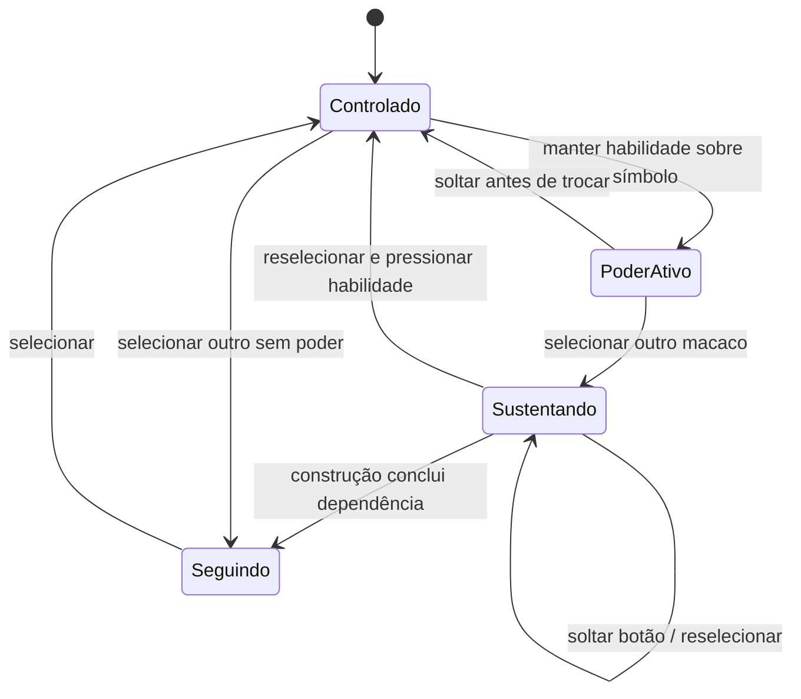

# Pré-produção 01 — direção, encenação e limites

Material implementado nas Etapas 1 e 2; revisão artística e validação com pessoas ainda pendentes. A especificação original continua sendo a referência, com as alterações posteriores do usuário no plano: PC, Esc devolvendo o scroll e conteúdo profissional extraído do currículo fornecido.

## Materiais de revisão

- `/estudo`, executando `npm run dev`: prancha raster do trio, estudos de pelagem, oito quadros da história, animatic com controle de tempo, seis quadros do jogo e mapa compacto.
- `/`: animatic ligado ao scroll e entrada em um protótipo 3D de cooperação ao final.
- `public/assets/concepts/trio-v1.png`: conceito gerado com a ferramenta integrada de imagens, orientado pela logo marrom fornecida. Prompt completo em `PROMPTS.md`.
- `src/features/story/SceneArt.tsx`: fonte SVG dos quadros esquemáticos e dos personagens do animatic.
- `src/features/studio/WorldMap.tsx`: mapa vetorial editável.

O caderno é uma ferramenta de produção, com anotações destinadas ao autor. A rota retorna 404 em produção, exceto quando `ENABLE_STUDIO=1` é configurado explicitamente para uma revisão interna. Ela não disponibiliza os links profissionais. O protótipo inteiro permanece com `noindex` até a etapa de publicação final.

## Personagens

| Personagem | Base / sombra / luz               | Silhueta e movimento                                | Pista além da cor                |
| ---------- | --------------------------------- | --------------------------------------------------- | -------------------------------- |
| Mizaru     | `#BD914E` / `#775528` / `#E0BD76` | Mais esguio, cautela, cabeça inclinada              | Olhos cobertos, triângulo, malha |
| Kikazaru   | `#D3D4C6` / `#868C81` / `#F0EEDF` | Centro baixo, curvas, equilíbrio                    | Ouvidos cobertos, círculo, ondas |
| Calado     | `#785237` / `#473325` / `#B37B4D` | Tronco firme, curiosidade prática, mãos expressivas | Boca coberta, quadrado, encaixe  |

A prancha estabelece uma espécie comum e a evolução bebê → criança → universitário → adulto. A mecha erguida, as orelhas circulares e o rosto claro preservam a identidade das logos. A mochila/livro no estudo universitário é acessório narrativo, não uniforme institucional.

Revisão visual inicial: pelagens, poses principais e continuidade de idade estão presentes. A distinção de proporções entre Mizaru/Kikazaru precisa ser acentuada no próximo estudo de modelagem. Faltam turnarounds, expressões adicionais, rig e animações definitivas. As figuras procedurais do protótipo são provisórias e não equivalem à prancha raster nem aos modelos finais.

## Storyboard e animatic

Os oito quadros e textos PT/EN estão definidos em `src/content/story.ts`. Notas acadêmicas respeitam o currículo: Ciência e Tecnologia/UFBA 2020–2024; Engenharia da Computação em andamento; mobilidade em Ciência da Computação/UFMG 2026.2. Não foi criada cronologia de empregos.

O animatic usa um único valor de progresso, obtido do ScrollTrigger ou do controle manual. Composição, deslocamentos, idades esquemáticas e fragmentos são calculados a partir desse valor, permitindo retorno sem acumular ações irreversíveis. Dissoluções ligam os quadros, inclusive escola → UFBA → mercado → UFMG. A preferência de movimento reduzido elimina deslocamentos e dissoluções.

Limites desta versão: desenhos esquemáticos, crescimento por escala e dissolução, mão metafórica sem rig, fragmentação simbólica. Ainda faltam a transformação tipográfica precisa de “Calado” em silhueta, a evolução de proporções dentro de cada idade, câmera 3D na logo e transição cinematográfica contínua para a física. Esses itens pertencem à produção após validação, não estão declarados concluídos.

Os seis quadros de jogo não contêm texto dentro da imagem. As anotações ficam nas legendas do caderno interno. Representam prólogo, ponte revelada, ondas anuladas, montagem, reconstrução e portais; as três máquinas e os três desafios da Oficina serão detalhados na produção de cada região.

## Mapa e ritmo propostos

Templo central, Jardim a oeste, Cidade a nordeste, Oficina a sudeste e Conexões ao sul. Primeira passagem: prólogo → Jardim → Cidade → Oficina → Templo → Conexões. Trajetos radiais permitem retorno posterior. Rastros de luz e silhuetas de marcos deverão comunicar orientação dentro do mundo.

Orçamento inicial de tempo da experiência final: prólogo 1–2 min, Jardim 2–3 min, Cidade 2–3 min, Oficina 2–4 min, retorno/templo 1–3 min. Ajustar por observação de visitantes para manter a soma entre 8 e 15 minutos. O trecho técnico atual não pretende cumprir essa duração.

## Protótipo de cooperação implementado

Dois terrenos, uma ponte temporária, um mecanismo de permanência, duas estações de poder e uma construção final. A área não é uma versão resumida dos capítulos finais: ela serve para validar os sistemas que serão reutilizados.

Mizaru revela a ponte no primeiro símbolo. Trocar para Calado mantém Mizaru no lugar. Calado atravessa e constrói perto do mecanismo, tornando a ponte permanente e liberando o companheiro. Depois, Kikazaru sustenta o campo no símbolo circular e Mizaru revela no símbolo triangular; Calado atravessa o obstáculo estabilizado e constrói o mecanismo final. O resultado é uma montagem luminosa sem texto de vitória.

Controles: WASD/setas; arrastar mouse para câmera; espaço para pulo; 1/2/3 e Q para troca; F para habilidade, remapeável para G/H; E/Enter para construção; R para reposicionamento; Esc para sair do modo jogo e devolver o scroll. O botão de retomar preserva o estado da sessão. Não há salvamento entre visitas.

Os companheiros seguem pontos próximos ao líder, centralizam a aproximação da ponte e verificam terreno antes de avançar. Saltam o obstáculo simples e podem recuperar posição quando presos ou muito distantes. Queda abaixo do limite restaura o grupo no ponto seguro correspondente à progressão. O protótipo ainda precisa de testes com pessoas para confirmar a naturalidade dessas regras.

## Fontes técnicas consultadas

- [Next.js: instalação](https://nextjs.org/docs/app/getting-started/installation) e guias locais da versão instalada para carregamento sob demanda e TypeScript.
- [React Three Rapier: documentação](https://pmndrs.github.io/react-three-rapier/) para física integrada ao React Three Fiber.

As versões efetivamente usadas estão fixadas em `package-lock.json`. Arte, sons finais, regiões e otimização de assets ainda serão produzidos em etapas próprias.
